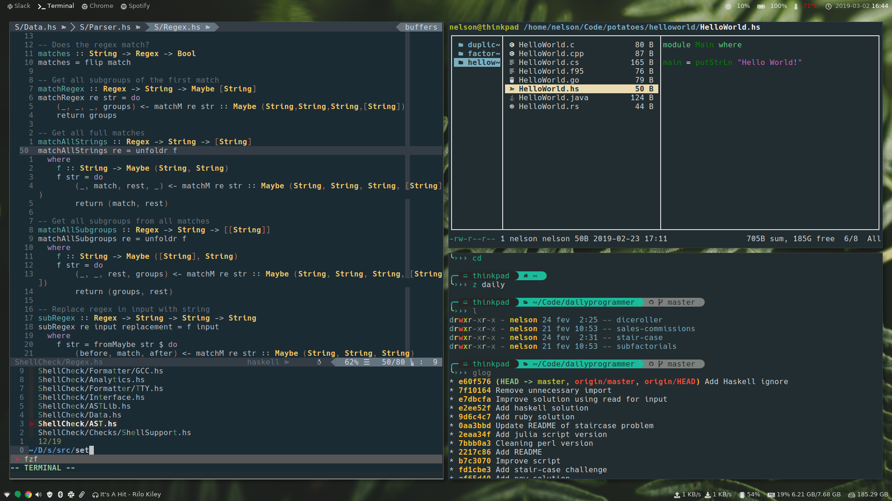

[semaphoreci]: https://semaphoreci.com/nelsonmestevao/dotfiles

<h1 align="center">
  <a target="_blank" href="https://dotfiles.github.io">
    
  </a>
</h1>

[][semaphoreci]

I really like to configure my system in every possible way. This repository
holds how I do it. If you are just starting out you could use mine (_I don't
care or mind_) but for your own sake **read them**. You will not get the most
out of it without.

Start by reading my neovim configuration. It follows a literate configuration
where it's documentation is the configuration files it selves. I write them
using markdown and neovim will interpret only the code blocks.

<div align="center">
  
</div>


## Install

I follow a very modular approach. If you don't want something you can just
remove it's folder. Imagine you don't want Neovim. You can just delete `nvim`
folder. It's that simple.


Start by cloning my `dotfiles` into `~/.dotfiles`. You should do the same with
my `spells` repository. Some scripts needed are there.

```shell
git clone https://github.com/nelsonmestevao/dotfiles ~/.dotfiles
git clone https://github.com/nelsonmestevao/spells   ~/.spells
```

Depending on your Linux distribution you should change the `distro.sh`
accordingly.

```shell
cd ~/.dotfiles
make install
```

## Uninstall

```shell
cd ~/.dotfiles
make uninstall
cd ~
rm -rf ~/.dotfiles
rm -rf ~/.spells
```

## Disclaimer

As you probably know, you shouldn't just run my Makefile without reading it
first. And if you read it, you will understand that it calls other scripts like
`install.sh` which depend on `helpers.sh`. Read those, it's the only way that
you can trust what it is doing.

