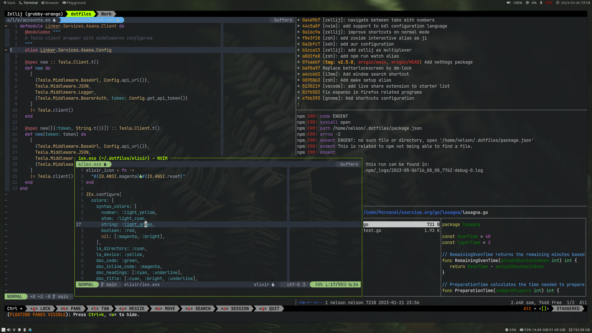
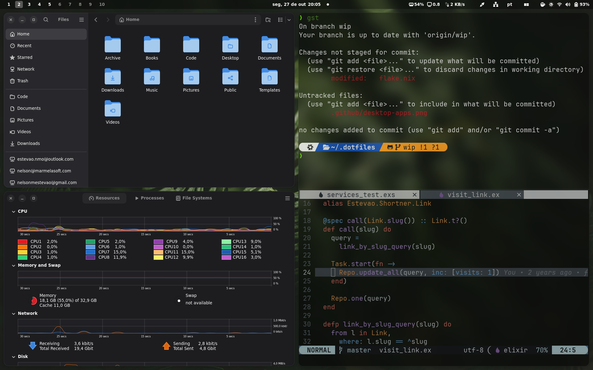
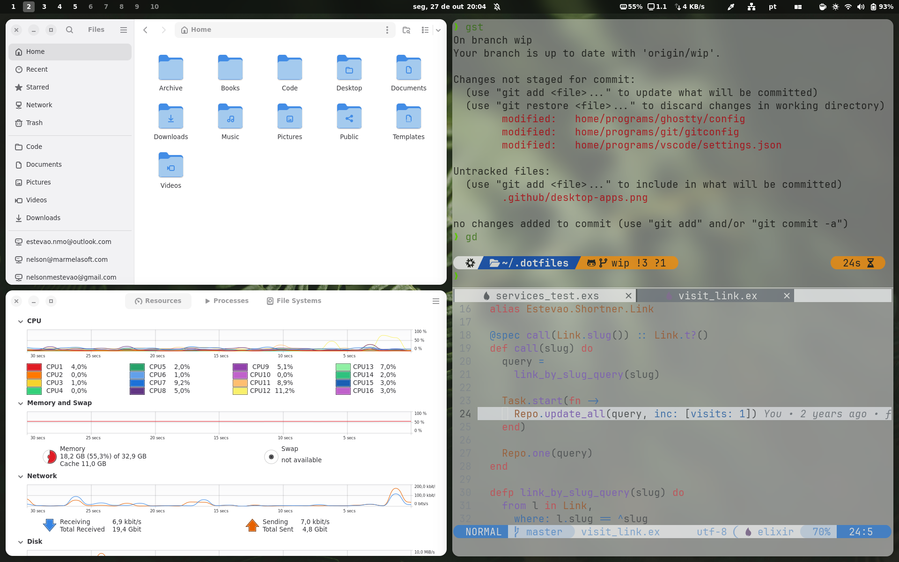
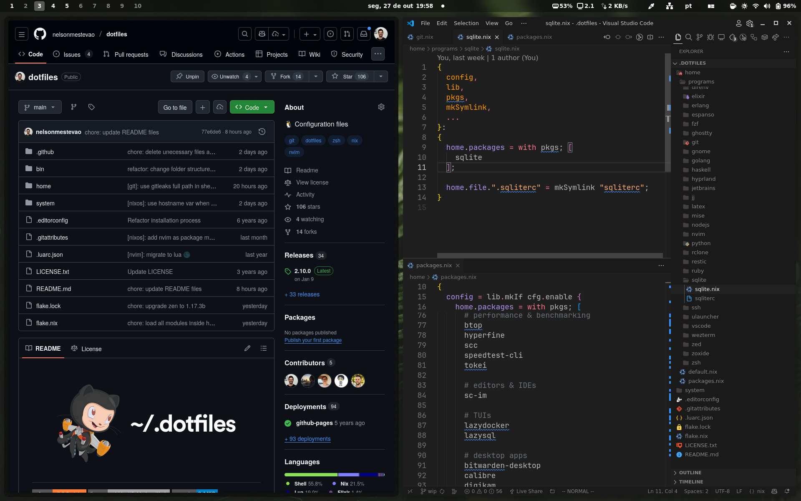

[releases]: https://github.com/nelsonmestevao/dotfiles/releases/latest
[ci]: https://github.com/nelsonmestevao/dotfiles/actions/workflows/ci.yml
[license]: #-license

<h1 align="center">
<picture>
  <source media="(prefers-color-scheme: dark)" srcset="/.github/header-LIGHT.png">
  <source media="(prefers-color-scheme: light)" srcset="/.github/header-DARK.png">
  
</picture>
</h1>

[][releases]
[][ci]
[][license]


I enjoy customizing every aspect of my system. This repository contains my
complete setup — from configuration files for the tools I use (managed through
symlinks) to the declarative configuration of my entire system using the Nix
package manager, language, and operating system.

If you're just getting started, feel free to use my setup (_I don't mind_ — see
the [LICENSE][license]). But for your own good, **take the time to read through
it**. You won't get the most out of it otherwise.

<div align="center">
  
</div>

<div align="center" class="flex">
  <sub>Light and Dark mode support.</sub><br/>
  
  
</div>

<div align="center">
  <sub>Desktop apps like VS Code and Zen Browser.</sub><br/>
  
</div>

## 🧩 Overview

This configuration is as modular as I can make it. It's split into two main
layers:

- **`home/`** — portable Home Manager configuration that works across any Linux
distribution. Many modules even work on macOS, except for platform-specific ones
like GNOME or Hyprland.

- **`system/`** — NixOS-specific configuration, containing only what's truly
necessary for the system layer (at least I try to).

### How modules work

Each program lives in its own folder under `home/programs/` as a self-contained
module. A helper called `mkHomeModule` wraps each one, providing a
`dotfiles.programs.<name>.enable` option and a `mkSymlink` function for
linking config files back to this repo.

> [!NOTE]
> `mkSymlink` creates **true Linux symlinks** pointing directly from your home
> directory into this repo, so you can edit config files in place and see
> changes immediately — no rebuild needed. This is how I like it.
>
> By default, Nix/Home Manager copies files into the read-only Nix store,
> requiring a rebuild for every change. This provides more guarantees like
> immutability. If you prefer that approach, replace `mkSymlink` calls with the
> standard `source` attribute:
> ```nix
> # Instead of:
> xdg.configFile."ghostty/config" = mkSymlink "config";
>
> # Use the standard Nix way:
> xdg.configFile."ghostty/config".source = ./config;
> ```

Similarly, NixOS system concerns live under `system/modules/` — each one
provides a `dotfiles.modules.<name>.enable` option for things like audio, boot,
networking, Docker, etc.

#### Where things are wired together

- **`home/users/<username>.nix`** — toggles which programs a user gets.
- **`system/hosts/<hostname>.nix`** — toggles which system modules a host gets.

Two helpers make it easy to control what runs where per host:

```nix
# home/users/nelson.nix
dotfiles.programs.nvim.enable = true;                            # everywhere
dotfiles.programs.jetbrains.enable = enableFor [ "framework" ];  # only on framework
dotfiles.programs.vscode.enable = disableFor [ "thinkpad" ];     # everywhere except thinkpad
```

```nix
# system/hosts/framework.nix
dotfiles.modules.audio.enable = true;
dotfiles.modules.docker.enable = true;
dotfiles.modules.tailscale.enable = true;
```

## 🚀 Installing

> [!WARNING]
> Helper scripts are available in the `bin/` directory.
> **Read them before running anything** — as always, never execute code you don't
understand or trust.

Start by cloning my `dotfiles` into `~/.dotfiles`. You should do the same with
my `spells` repository. The spells are not a requirement but there's a lot of
goodies there.

```shell
git clone https://github.com/nelsonmestevao/dotfiles ~/.dotfiles
git clone https://github.com/nelsonmestevao/spells   ~/.spells
```

The only requirement would be to have NixOS or Nix package manager installed.
Then you are ready to build this configuration for your system.

```shell
bin/rebuild          # rebuild both OS and home config
bin/rebuild os       # rebuild only the NixOS system configuration
bin/rebuild home     # rebuild only the home-manager configuration
```

### Adapting for your own system

1. **Add your host** in `flake.nix` under the `hosts` attribute set.
2. **Add your user** in `flake.nix` under `users` and create a file at
   `home/users/<username>.nix` — use `nelson.nix` as a reference.
3. **If using NixOS**, add your hardware config under
   `system/hosts/<hostname>/hardware.nix`.
4. **Pick your programs** by setting `dotfiles.programs.<name>.enable = true` in
   your user file.

## 📄 License

This repository is licensed under the [WTFNMFPL](LICENSE.txt).

<div align="center">
  <sub>Use your tools well or use better tools.</sub>
</div>
