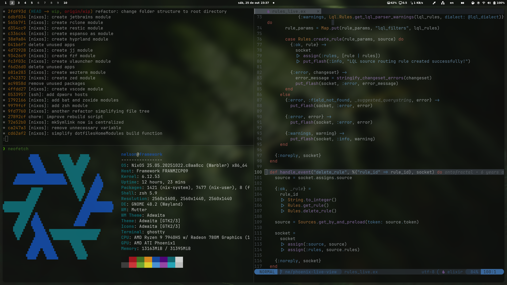

[releases]: https://github.com/nelsonmestevao/dotfiles/releases/latest
[license]: #memo-license

<h1 align="center">
<picture>
  <source media="(prefers-color-scheme: dark)" srcset="/.github/header-LIGHT.png">
  <source media="(prefers-color-scheme: light)" srcset="/.github/header-DARK.png">
  
</picture>
</h1>

[][releases]
[][license]


I enjoy customizing every aspect of my system. This repository contains my
complete setup — from configuration files for the tools I use (managed through
symlinks) to the declarative configuration of my entire system using the Nix
package manager, language, and operating system.

If you’re just getting started, feel free to use my setup (_I don’t mind_ — see
the [LICENSE][license]). But for your own good, **take the time to read through
it**. You won't get the most out of it otherwise.

<div align="center">
  
</div>

## 🧩 Overview

This configuration is as modular as I can make it. It’s split into two main
directories:

- `home/`: portable configuration that works across any Linux distribution. Many
modules even work on macOS, except for platform-specific ones like GNOME or
Hyprland.

- `system/`: NixOS-specific configuration, containing only what’s truly
necessary for the system layer (at least I try to).

## 🚀 Installing

Every folder in `home/programs/*` is a module that brings the option
`dotfiles.programs.<name>.enable` and can be activated or deactivated but commenting
or setting it to `false`. Complex setups can easily be built by composing and
reusing these modular pieces.

> [!WARNING]
> Helper scripts are available in the bin/ directory.
> **Read them before running anything** — as always, never execute code you don’t
understand or trust.

Start by cloning my `dotfiles` into `~/.dotfiles`. You should do the same with
my `spells` repository. The spells are not a requirement but there's a lot of
goodies there.

```shell
git clone https://github.com/nelsonmestevao/dotfiles ~/.dotfiles
git clone https://github.com/nelsonmestevao/spells   ~/.spells
```

The only requirement would be to have NixOS or Nix package manager installed.
Then you are ready to build this configuration for your system.

```shell
bin/rebuild (home | os)
```

More documentation will be provided on exactly how to customize things.

## 📄 License

This repository is licensed under the [WTFNMFPL](LICENSE.txt).

<div align="center">
  <sub>Use your tools well or use better tools.</sub>
</div>

